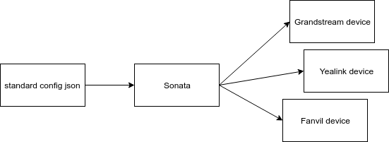
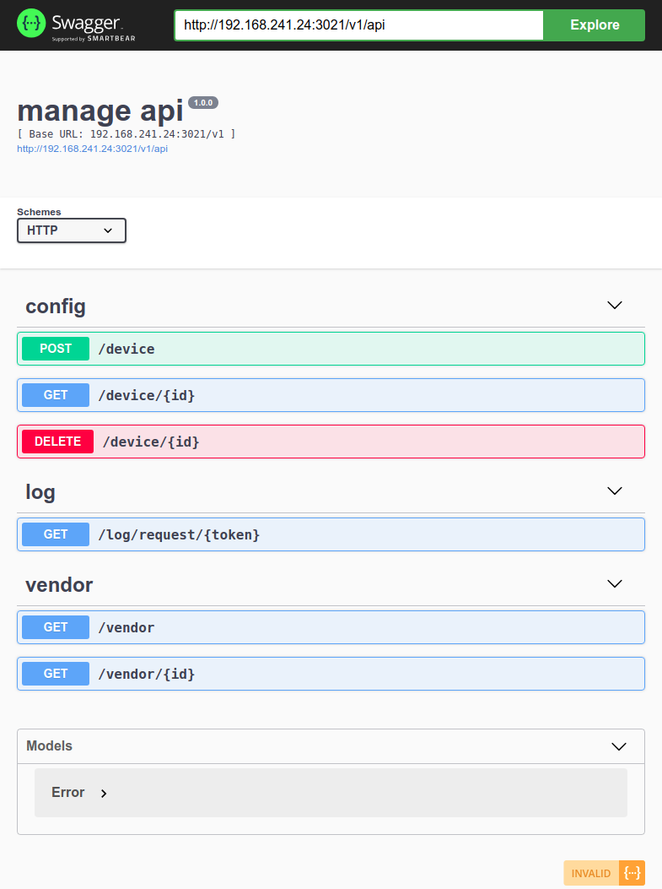

# sonata

Small free & open source SIP provisioning server

## How work

## Vendors

- Grandstream

- Fanvil

- Panasonic

- Yealink

- Digium

- AudioCodes

## Rules

Limited access by

- ip

- mac

- time

## Scopes

- accounts

- timezones

- phonebooks

- ntp

- firmware

## API

- upload config for SIP devices in JSON format

- separated API for provisioning and management

- support Swagger 2.0 API spec

### Provision API

### Management API

## Sample

see [sonata-sample](https://github.com/antirek/sonata-sample)

## Great thanks

- @freess 

- @k666r

- @igorg

