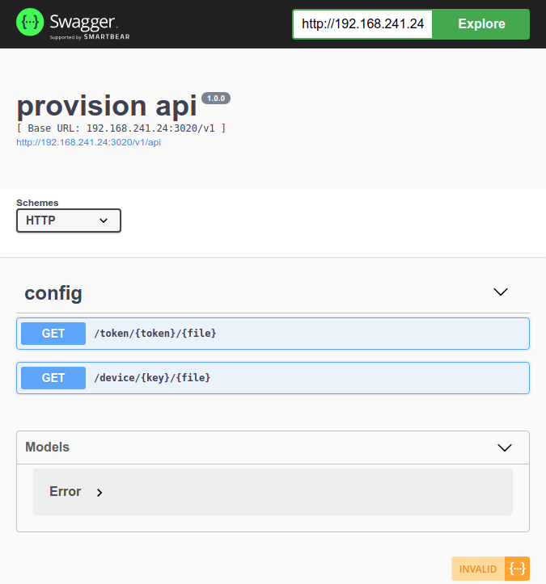

# sonata

Small free & open source SIP provisioning server

## How work

## Vendors

- Grandstream

- Fanvil

- Panasonic

- Yealink

- Digium

## Rules

Limited access by

- ip

- mac

- time

## API

- upload config for SIP devices in JSON format

- separated API for provisioning and management

- support Swagger 2.0 API spec

### Provision API

### Management API

# Great thanks 

@freess @k666r